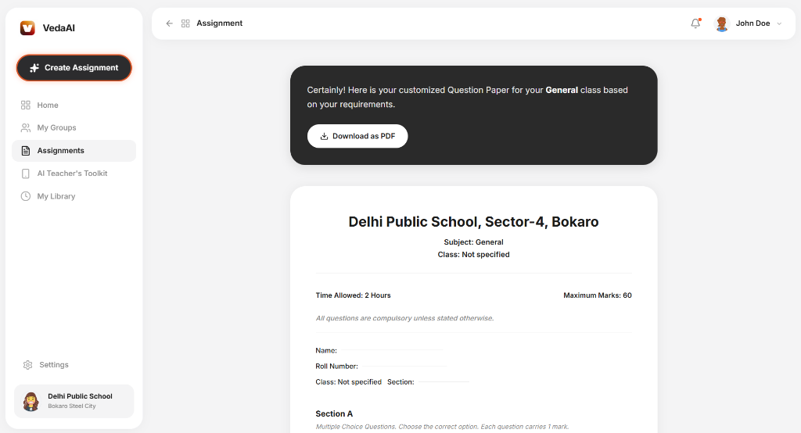
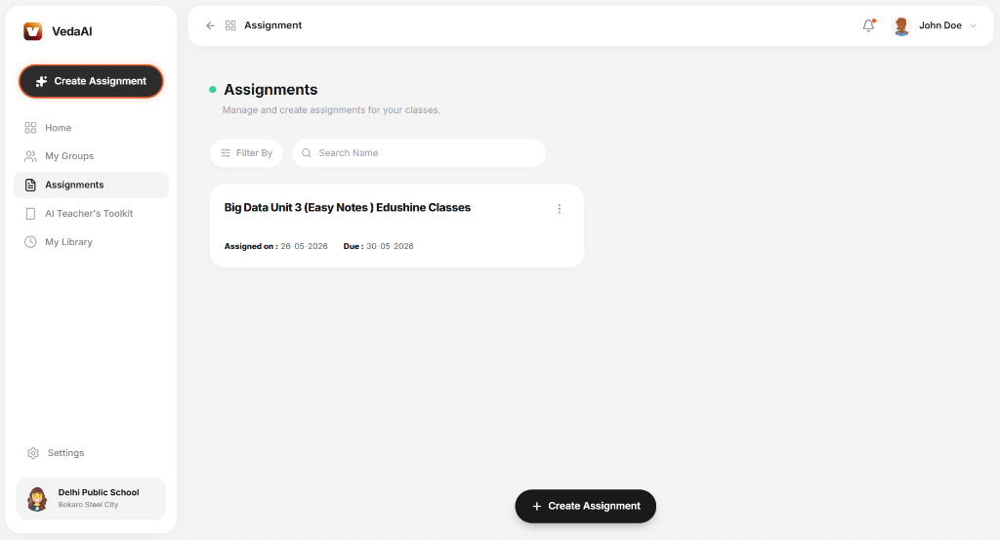
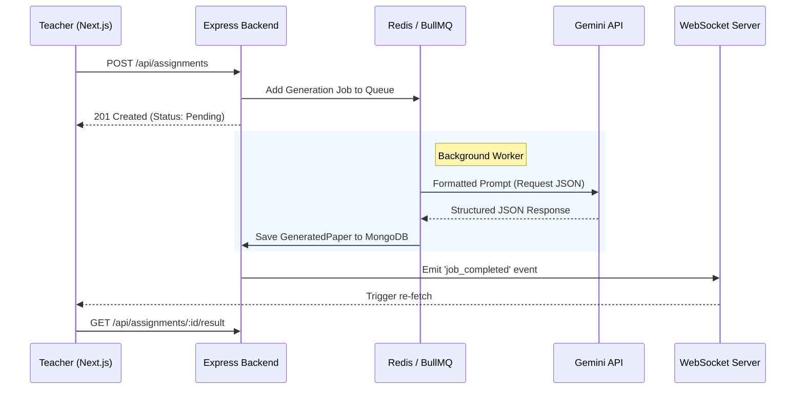

# VedaAI Assessment Creator

VedaAI Assessment Creator is a full-stack web application that allows teachers to instantly generate structured assessment papers using Artificial Intelligence. The UI is built to precisely match the provided Figma designs.

## Screenshots

<div style="display: flex; flex-direction: column; gap: 20px;">
  
  
</div>

## Features

- **Pixel-Perfect UI:** Built with Tailwind CSS to match the Figma mockups.
- **Asynchronous AI Generation:** Background processing using BullMQ prevents UI blocking during LLM generation.
- **Real-Time Updates:** WebSockets push instant feedback to the frontend when generation finishes.
- **PDF Export:** A headless Puppeteer engine dynamically renders the paper to a downloadable A4 PDF.
- **PDF Context Parsing:** Extracts raw text from uploaded reference documents (using `pdf-parse`) and strictly restricts the AI to generate questions solely from the provided text.
- **Structured LLM Output:** Uses the Gemini API with JSON schema enforcement to ensure strictly typed exam papers rather than raw text.

## Architecture

The system uses a modern monorepo separating client and server:

### Frontend
- Next.js (App Router) + TypeScript
- Zustand for global state management
- Tailwind CSS for styling
- Socket.io-client for real-time updates

### Backend
- Node.js + Express (TypeScript)
- MongoDB & Mongoose for storage
- Redis + BullMQ for asynchronous job queues
- Google Gemini API for LLM generation
- Socket.io for WebSocket notifications
- Puppeteer for PDF generation
- pdf-parse for extracting text from uploaded reference documents



## Setup Instructions

**Prerequisites:** Node.js (v18+), MongoDB URI, Redis URL, Gemini API Key.

### 1. Clone Repository
```bash
git clone <repository-url>
cd veda-ai-assessment-creator
```

### 2. Backend Setup
```bash
cd backend
npm install
```
Create a `.env` file in the `backend/` directory:
```env
PORT=5000
NODE_ENV=development
MONGODB_URI=your_mongodb_uri
REDIS_URL=your_redis_url
GEMINI_API_KEY=your_gemini_api_key
FRONTEND_URL=http://localhost:3000
```
Start the backend:
```bash
npm run dev
```

### 3. Frontend Setup
Open a new terminal window:
```bash
cd frontend
npm install
```
Start the frontend:
```bash
npm run dev
```

### 4. Usage
Open `http://localhost:3000` in your browser. Create an assignment, wait for the AI generation via WebSockets, and download the resulting paper as a PDF.
