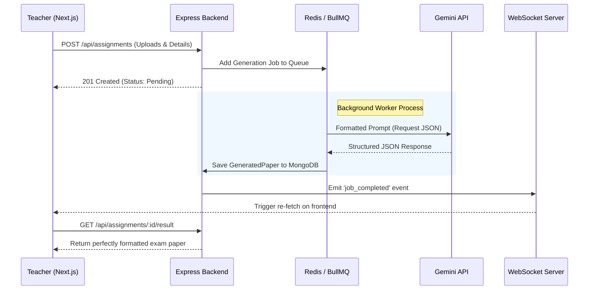

# VedaAI Assessment Creator

VedaAI Assessment Creator is a full-stack platform that empowers teachers to instantly generate structured, high-quality assessment papers using Artificial Intelligence. 

This project was built from the ground up to match the provided Figma designs perfectly, ensuring a premium user experience while utilizing a robust backend queue architecture to handle asynchronous AI generation reliably.

## ✨ Features (Including All Bonus Features)

- **Pixel-Perfect UI:** Meticulously crafted using Tailwind CSS to match the Figma mockups exactly.
- **Asynchronous AI Generation:** Background processing using BullMQ prevents the UI from blocking during long LLM generation times.
- **Real-Time Updates:** WebSocket integration provides instant feedback on the frontend the moment the AI finishes generating the paper.
- **Bonus: PDF Export Engine:** Built-in Puppeteer engine on the backend dynamically renders the generated paper to a perfectly formatted A4 PDF for downloading and printing.
- **Bonus: UI Polish & Caching:** Added subtle micro-animations, loading states, error boundaries, and Redis-backed state management for jobs.
- **Structured AI Output:** We enforce JSON schema generation with the Gemini API to ensure the output is always a perfectly parsable, strictly typed exam paper (never raw text).

---

## 🏗️ Architecture Overview

The application is structured as a modern monorepo separating the client and server concerns. 

Here is the flow of how the asynchronous LLM generation works:



### **Frontend (Client)**
- **Next.js (App Router) + TypeScript:** Provides a fast, server-rendered foundation.
- **Zustand:** Lightweight, hook-based state management for tracking active assignments and background job statuses globally.
- **Tailwind CSS:** Utility-first styling utilized to precisely match the Figma design tokens (e.g., specific `#FF5B22` brand orange, custom shadow layers).
- **Socket.io-client:** Listens to the backend for real-time progress updates.

### **Backend (Server)**
- **Node.js + Express (TypeScript):** Robust API handling uploads and database interactions.
- **MongoDB & Mongoose:** Persistent storage for Assignments and the resulting `GeneratedPaper` structures.
- **Redis + BullMQ:** High-performance background job queue. When a teacher requests a paper, the API immediately returns a 201 Created and offloads the heavy LLM generation to BullMQ workers.
- **Google Gemini API (`@google/genai`):** The LLM engine. We utilize strict prompt engineering and `responseSchema` directives to force the AI to return structured arrays of questions, difficulties, and marks.
- **Socket.io:** Emits real-time push notifications to clients when BullMQ jobs succeed or fail.
- **Puppeteer:** A headless Chrome instance that converts HTML representations of the exam paper into downloadable PDFs.

---

## 🛠️ Approach & Technical Decisions

1. **Strictly Typed AI:** The biggest challenge in building LLM apps is unreliable formatting. Instead of rendering raw markdown, the backend instructs the LLM to return a strict JSON interface (`ISection[]` containing `IQuestion[]`). This allows the frontend to render the paper beautifully, calculate totals, and inject custom CSS for PDF printing.
2. **Event-Driven UX:** Because LLMs can take 15-30 seconds to generate an entire exam paper, standard HTTP requests would timeout. By utilizing Redis and BullMQ, we adopted an asynchronous workflow: *Submit -> Queue -> WebSocket Notify -> Re-fetch*.
3. **Design Fidelity:** Extensive time was spent refining the Tailwind configuration to ensure colors, border radii, shadows, and spacing exactly matched the Figma file to create a high-signal, premium feel.

---

## 🚀 Setup Instructions

### Prerequisites
- Node.js (v18+)
- MongoDB connection string
- Upstash Redis (or local Redis) URL
- Gemini API Key

### 1. Clone the repository
```bash
git clone <repository-url>
cd veda-ai-assessment-creator
```

### 2. Backend Setup
```bash
cd backend
npm install
```

Create a `.env` file in the `backend/` directory:
```env
PORT=5000
NODE_ENV=development
MONGODB_URI=your_mongodb_uri
REDIS_URL=your_redis_url
GEMINI_API_KEY=your_gemini_api_key
FRONTEND_URL=http://localhost:3000
```

Start the backend development server:
```bash
npm run dev
```

### 3. Frontend Setup
Open a new terminal window:
```bash
cd frontend
npm install
```

Start the frontend development server:
```bash
npm run dev
```

### 4. Usage
Open [http://localhost:3000](http://localhost:3000) in your browser. Create a new assignment, watch the real-time processing state via WebSockets, and download the resulting paper as a beautifully formatted PDF!
